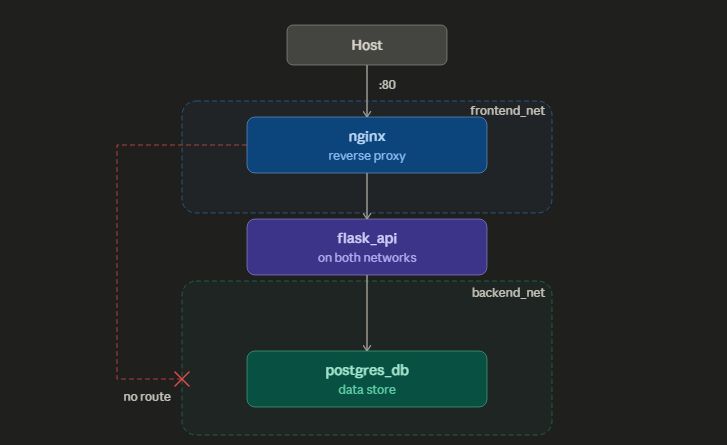

# Architecture

## Stage 1: Baseline

### Design decisions

**Two named networks instead of the default bridge.** Docker's default bridge network gives every container access to every other container with no isolation. `frontend_net` and `backend_net` are created explicitly so membership, and therefore reachability, is a deliberate choice per container.

**flask_api connects to both networks.** It is the only container that needs to receive proxied requests from nginx and make database queries. Dual membership makes it the controlled crossing point between tiers. nginx has no path into `backend_net` and postgres_db has no path into `frontend_net`.

**Only nginx exposes a host port.** Exposing a port on flask_api or postgres_db directly would allow connections that bypass nginx entirely. Port 80 on nginx is the single entry point into the stack.

**Container names instead of IPs.** Docker's embedded DNS resolver at `127.0.0.11` resolves container names within a shared network. IPs change on container restart but names do not. A container not on the same network cannot resolve the name at all, which is why `nginx ping postgres_db` returns `bad address` rather than a timeout.

**Isolation is kernel-enforced, not config-enforced.** Network namespace separation means a container has no interface on a network it is not connected to. There is no firewall rule to misconfigure. The path simply does not exist.

---

