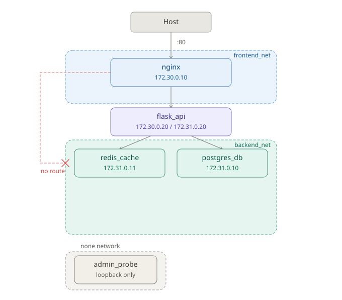

# Architecture

## Stage 1: Baseline

### Design decisions

**Two named networks instead of the default bridge.** Docker's default bridge network gives every container access to every other container with no isolation. `frontend_net` and `backend_net` are created explicitly so membership, and therefore reachability, is a deliberate choice per container.

**flask_api connects to both networks.** It is the only container that needs to receive proxied requests from nginx and make database queries. Dual membership makes it the controlled crossing point between tiers. nginx has no path into `backend_net` and postgres_db has no path into `frontend_net`.

**Only nginx exposes a host port.** Exposing a port on flask_api or postgres_db directly would allow connections that bypass nginx entirely. Port 80 on nginx is the single entry point into the stack.

**Container names instead of IPs.** Docker's embedded DNS resolver at `127.0.0.11` resolves container names within a shared network. IPs change on container restart but names do not. A container not on the same network cannot resolve the name at all, which is why `nginx nslookup postgres_db` returns `NXDOMAIN` rather than a timeout.

**Isolation is kernel-enforced, not config-enforced.** Network namespace separation means a container has no interface on a network it is not connected to. There is no firewall rule to misconfigure. The path simply does not exist.

---

## Stage 2: Docker Network Segmentation

### Extensions

**Redis on backend_net.** `redis_cache` joins `backend_net` alongside `postgres_db`. flask_api resolves both services by container name. nginx returns `NXDOMAIN` for both, confirming that adding a service to `backend_net` does not change what nginx can reach.

**None network isolation.** `admin_probe` runs on `--network none`. Docker creates a network namespace for the container but attaches no interfaces to it. `ip addr` shows only loopback. Name resolution fails entirely because no DNS resolver is injected. External routing fails because no interface exists to send packets on.

**Host network comparison.** A short-lived Alpine container run with `--network host` shares the host's network namespace directly. `ip addr` exposes every Docker bridge interface and veth pair currently active on the machine, including the host-side ends of the connections to every running container. This is the opposite end of the isolation spectrum from the none network.

**Custom CIDR subnets with static IPs.** Networks recreated with explicit subnets (`172.30.0.0/24` for `frontend_net`, `172.31.0.0/24` for `backend_net`) and containers assigned static IPs within those ranges. flask_api holds two IPs simultaneously, one per network.

| Container | Network | IP |
|---|---|---|
| nginx | frontend_net | 172.30.0.10 |
| flask_api | frontend_net | 172.30.0.20 |
| flask_api | backend_net | 172.31.0.20 |
| postgres_db | backend_net | 172.31.0.10 |
| redis_cache | backend_net | 172.31.0.11 |
| admin_probe | none | 127.0.0.1 only |
