# Verification

## Stage 1: Baseline (Nginx, Flask API, PostgreSQL)

Stage 1 establishes a three-tier architecture across two isolated bridge networks. nginx is the only container with an exposed host port. postgres_db is unreachable from nginx. Only flask_api, which bridges both networks, can connect to it.

---

### 1. All three containers running

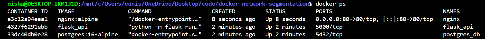

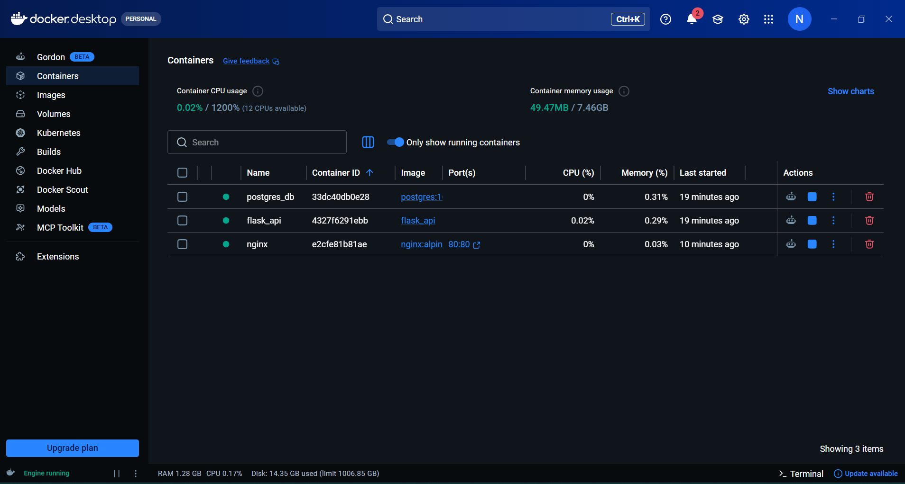

Docker Desktop showing `postgres_db`, `flask_api`, and `nginx` all running simultaneously. nginx has port 80:80 mapped to the host, the only exposed port in the stack.

---

### 2. Networks created

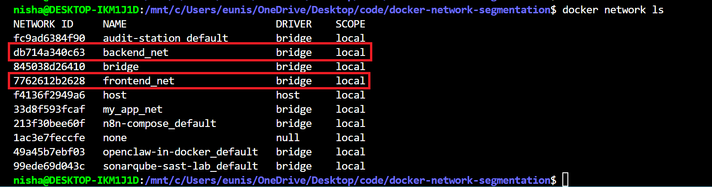

`docker network ls` confirming both `frontend_net` and `backend_net` exist as bridge networks with local scope. Also visible: the `none` and `host` networks used in Stage 2.

---

### 3. Verification terminal output

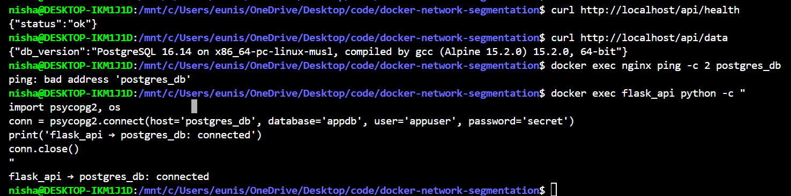

All four verification commands in a single frame:

- `curl http://localhost/api/health` returns `{"status":"ok"}`, nginx is proxying to flask_api
- `curl http://localhost/api/data` returns the PostgreSQL 16.14 version string, full stack query working
- `docker exec nginx ping -c 2 postgres_db` returns `bad address 'postgres_db'`, network isolation confirmed
- `docker exec flask_api python -c "..."` prints `flask_api connected to postgres_db`, flask_api has a valid route via backend_net

---

### 4. API health endpoint in browser

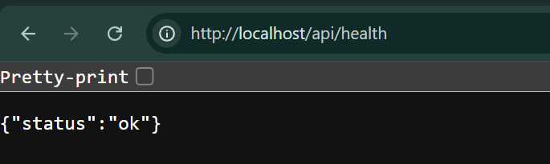

`http://localhost/api/health` returning `{"status":"ok"}` in the browser. Confirms the full request path: browser to host port 80 to nginx to flask_api to response.

---

### 5. API data endpoint in browser

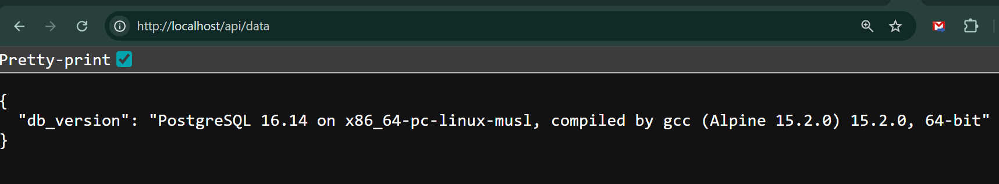

`http://localhost/api/data` returning the live PostgreSQL 16.14 version string. Confirms the complete end-to-end chain: browser to nginx to flask_api to postgres_db to response.

---

### 6. Automated verification script

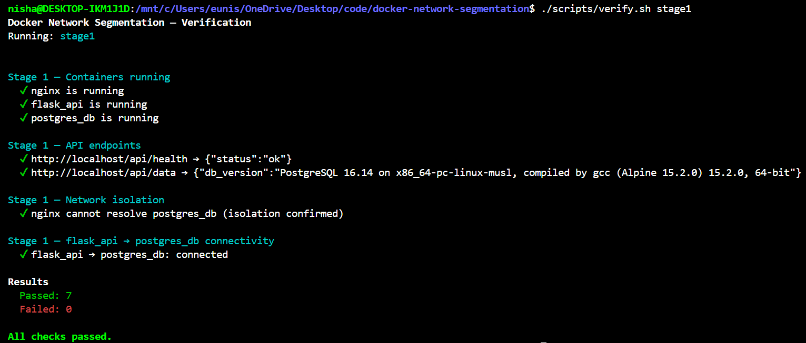

`./scripts/verify.sh stage1` passing all 7 checks. Confirms the full stack, API endpoints, network isolation, and database connectivity in a single repeatable run.

---

### Summary

| Test | Command | Expected | Result |
|---|---|---|---|
| Health check | `curl /api/health` | `{"status":"ok"}` | ✅ Pass |
| DB query | `curl /api/data` | PostgreSQL version | ✅ Pass |
| Isolation: nginx blocked | `docker exec nginx ping postgres_db` | `bad address` | ✅ Pass |
| Isolation: flask_api allowed | `python psycopg2.connect(...)` | connected | ✅ Pass |

---

## Stage 2: Docker Network Segmentation

Stage 2 extends the baseline with Redis on `backend_net`, a fully isolated `admin_probe` container on the `none` network, a host network comparison, and custom CIDR subnets with static IP assignments.

---

### 1. All five containers running

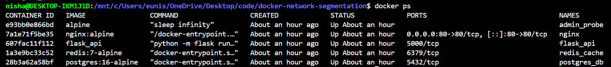

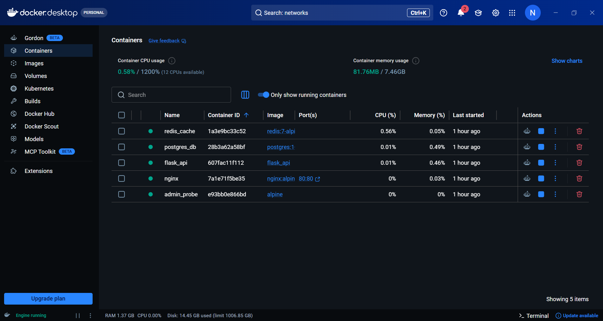

Docker Desktop showing all five containers running simultaneously: `nginx`, `flask_api`, `postgres_db`, `redis_cache`, and `admin_probe`.

---

### 2. DNS resolution from flask_api

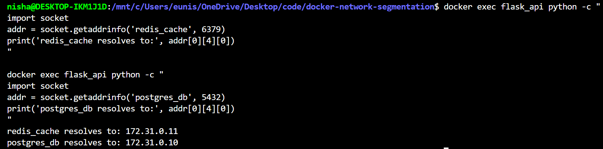

`flask_api` resolving both backend services by container name using Docker's embedded DNS resolver at `127.0.0.11`. `redis_cache` resolves to `172.31.0.11` and `postgres_db` resolves to `172.31.0.10`, the static IPs assigned in Phase D. Container names resolve correctly regardless of IP assignment.

---

### 3. nginx blocked from backend_net services

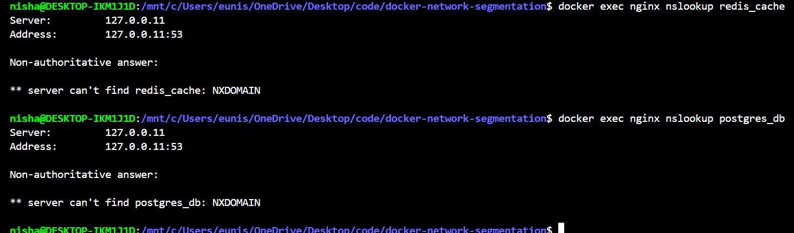

`nslookup` from nginx returning `NXDOMAIN` for both `redis_cache` and `postgres_db`. The DNS resolver at `127.0.0.11` is present in every container but only returns records for services on shared networks. nginx is on `frontend_net` only, so backend services are invisible to it.

---

### 4. admin_probe network interfaces

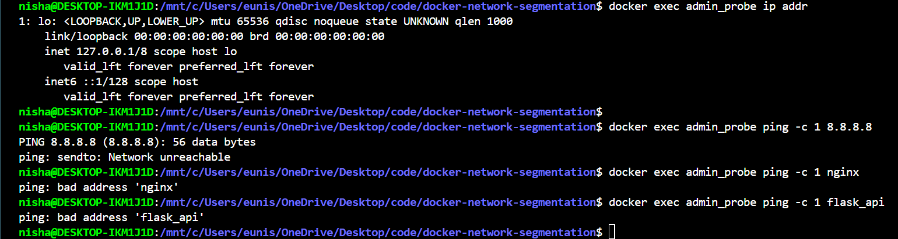

`ip addr` inside `admin_probe` showing only the `lo` loopback interface at `127.0.0.1`. No `eth0`, no Docker veth pair. Docker created a network namespace for the container but attached nothing to it.

---

### 5. admin_probe isolation proof

Three distinct failure modes from `admin_probe` on the `none` network:

- `ping 8.8.8.8` returns `Network unreachable`, the kernel has no interface to route the packet on
- `ping nginx` returns `bad address`, no DNS resolver is attached so name resolution fails before a packet is attempted
- `ping flask_api` returns `bad address` for the same reason

---

### 6. flask_api dual IP assignment

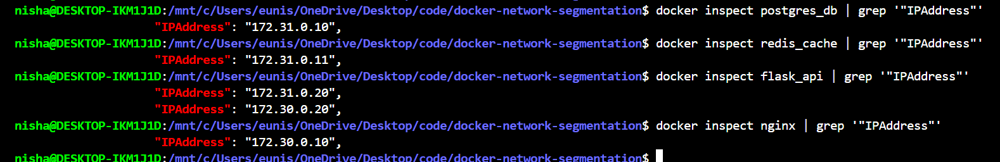

`docker inspect flask_api` showing two IP addresses: `172.31.0.20` on `backend_net` and `172.30.0.20` on `frontend_net`. This confirms flask_api holds a presence on both networks simultaneously.

---

### 7. Automated verification script

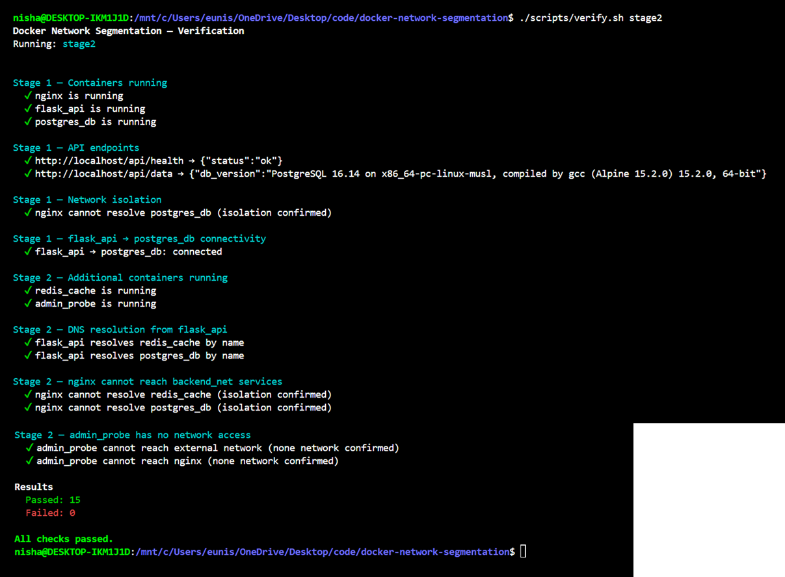

`./scripts/verify.sh stage2` passing all 15 checks across both stages. Confirms Stage 1 isolation still holds after Stage 2 extensions, all new services are running, DNS resolution works from flask_api, nginx is blocked from all backend services, and admin_probe has no network access.

---

### Summary

| Test | Expected | Result |
|---|---|---|
| All 5 containers running | Up | ✅ Pass |
| flask_api resolves redis_cache | 172.31.0.11 | ✅ Pass |
| flask_api resolves postgres_db | 172.31.0.10 | ✅ Pass |
| nginx cannot resolve redis_cache | NXDOMAIN | ✅ Pass |
| nginx cannot resolve postgres_db | NXDOMAIN | ✅ Pass |
| admin_probe: no external route | Network unreachable | ✅ Pass |
| admin_probe: no DNS | bad address | ✅ Pass |
| flask_api dual IP | 172.30.0.20, 172.31.0.20 | ✅ Pass |
| Full verify script | 15/15 pass | ✅ Pass |
